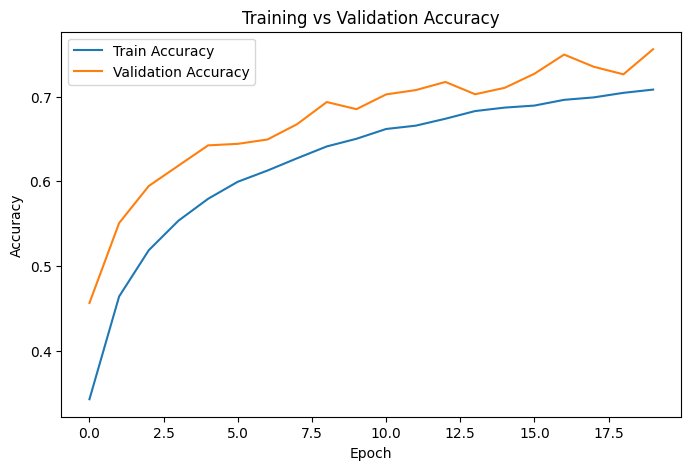
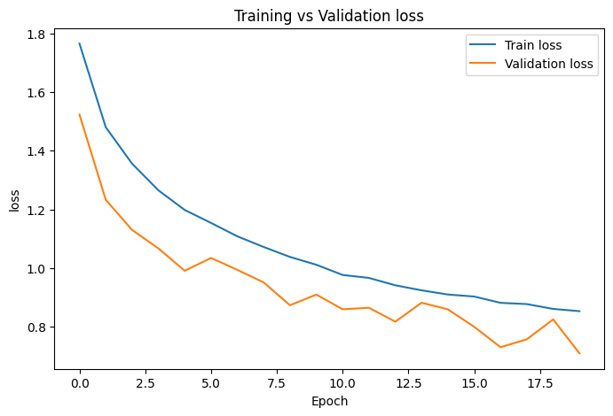
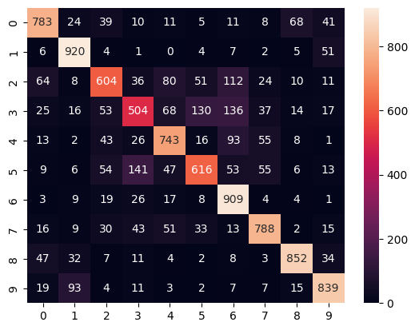
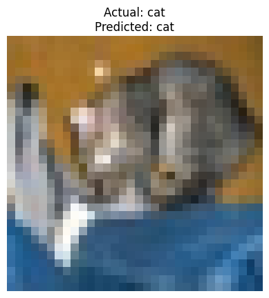
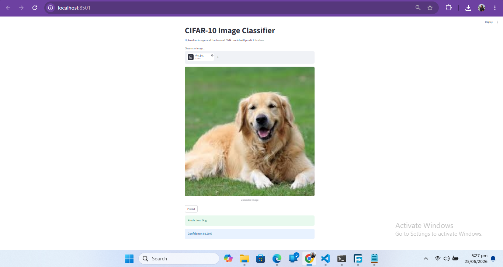

# CIFAR-10 Image Classification using CNN

This project trains a Convolutional Neural Network (CNN) on the CIFAR-10 dataset to classify 10 object categories.  
It also includes data preprocessing, augmentation, model evaluation, and a simple Streamlit app for image inference.

## Project Objective

- Train and evaluate a deep learning model on CIFAR-10
- Apply preprocessing and data augmentation
- Improve performance through experimentation and optimization
- Analyze model performance and accuracy
- Build a simple real-world prediction app
- Keep the code clean, documented, and reproducible

## Dataset

The project uses the CIFAR-10 dataset, which contains 60,000 color images in 10 classes:

- airplane
- automobile
- bird
- cat
- deer
- dog
- frog
- horse
- ship
- truck

## Project Structure

```bash
.
├── app.py
├── cifar10_cnn.keras
├── CIFAR_10_Image_Classification_using_CNN.ipynb
├── requirements.txt
├── sample_images/
├── performance_images/
└── README.md
```

## Model Summary

The CNN pipeline includes:

- Convolution layers for feature extraction
- MaxPooling layers for downsampling
- Dropout for regularization
- Dense layers for classification
- Softmax output layer for 10 classes

## Data Preprocessing

- Normalized pixel values to a 0–1 range
- Resized input images to 32×32 for inference
- Converted uploaded images to RGB format in the Streamlit app

## Data Augmentation

The training notebook applies augmentation such as:

- Rotation
- Width shift
- Height shift
- Horizontal flip

These help the model generalize better and reduce overfitting.

## Training Details

- Optimizer: Adam
- Loss: Sparse Categorical Crossentropy
- Metric: Accuracy
- Training epochs: 20 for the improved model

## Performance Results

From the experiments in the notebook:

- **Baseline CNN Accuracy:** around **69%–70%**
- **Improved CNN Accuracy:** around **73%–75%**

The improved model performs better because of augmentation and dropout regularization.

### Training Accuracy



### Training Loss



### Confusion Matrix



### Sample Prediction



### Streamlit Application



## Inference Application

The Streamlit app allows a user to:

1. Upload an image
2. Resize it to 32×32
3. Normalize pixel values
4. Load the saved model
5. Predict the class and confidence score

### Run the app

```bash
streamlit run app.py
```

## How to Train

Open the notebook and run the cells in order:

1. Load CIFAR-10 dataset
2. Normalize the images
3. Apply augmentation
4. Build the CNN model
5. Train the model
6. Evaluate accuracy and loss
7. Save the trained model as `cifar10_cnn.keras`

## GitHub Submission Checklist

- Source code
- README documentation
- Setup instructions
- Training instructions
- Performance results
- Screenshots / figures
- Saved trained model

## Technologies Used

- Python
- TensorFlow / Keras
- NumPy
- Matplotlib
- Seaborn
- Pillow
- Streamlit

## Notes

The small variation in accuracy between runs is normal for CNN training because of random initialization, shuffling, augmentation, and GPU nondeterminism.
